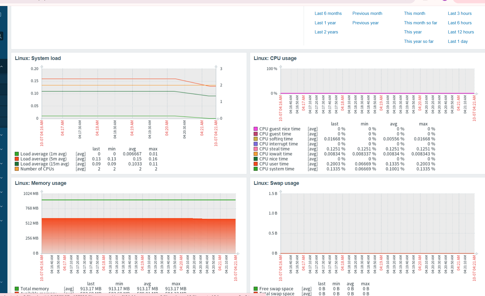
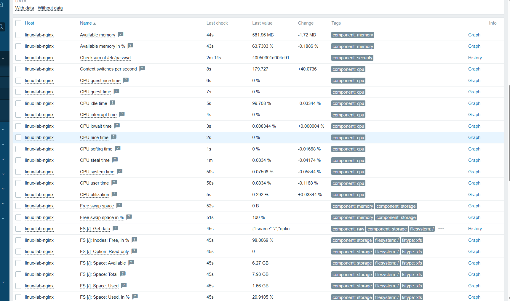
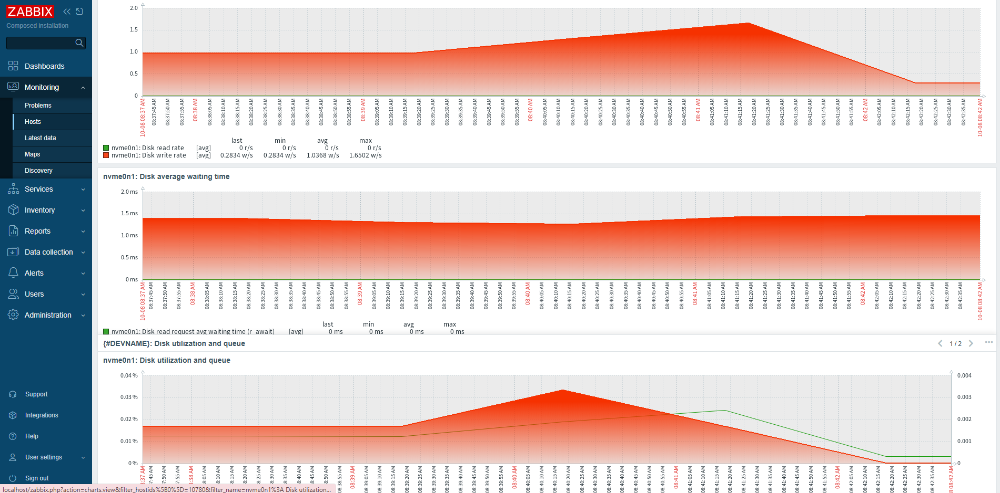
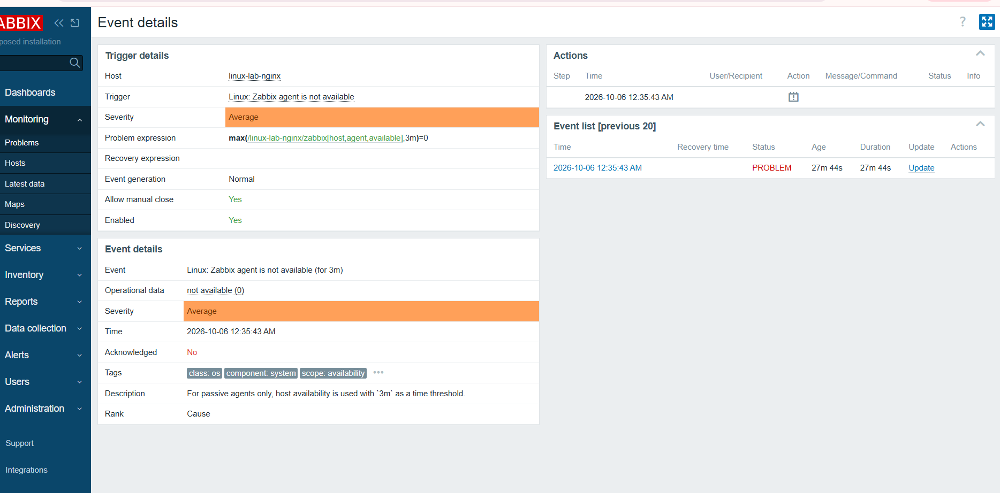
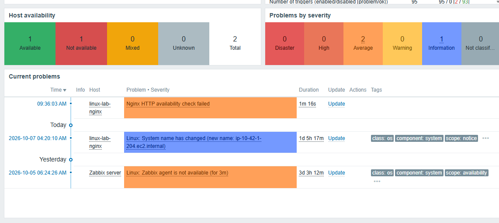
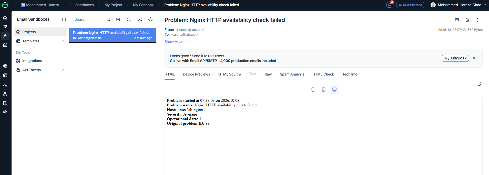
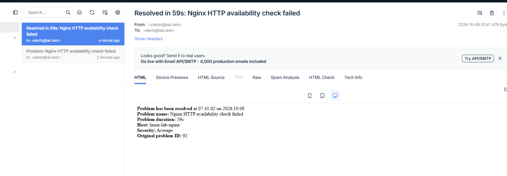

# AWS Linux Infrastructure Lab

Terraform-managed AWS infrastructure demonstrating Linux administration, network
access controls, service recovery, and email alerting. An Amazon Linux 2023 EC2
instance runs Nginx as the workload, with administration through AWS Systems
Manager Session Manager and EC2 health notifications through CloudWatch and SNS.
Zabbix collects Linux metrics and sends HTTP problem and recovery notifications
to a Mailtrap sandbox.

**Technologies:** AWS EC2, VPC, IAM, Systems Manager, CloudWatch, SNS, EBS,
Terraform, Linux, Bash, systemd, Nginx, Git, GitHub Actions, Zabbix, and Mailtrap.

## Architecture and design

- **Networking:** dedicated VPC and public subnet, with an internet gateway and
  route table for internet connectivity.
- **Access:** HTTP restricted to one configured public IPv4 address (`/32`).
  Encrypted Zabbix agent checks on TCP 10050 use the same permitted address.
  Administration uses Session Manager with no inbound SSH rule.
- **Server:** Amazon Linux 2023 on a `t3.micro`, with an encrypted 8 GiB gp3 root
  volume and IMDSv2 required.
- **Bootstrap:** EC2 user data installs Nginx, the health-check script, and the
  systemd service and timer from this repository. Nginx, the SSM agent, and the
  timer are enabled automatically. A dedicated `lab-health-check` Linux account
  runs the checks without requiring an interactive login.
- **Permissions:** an EC2 instance role provides the SSM agent's AWS permissions.
  Separate deployment policies support Terraform and interactive administration.
- **Monitoring:** a CloudWatch alarm evaluates EC2 `StatusCheckFailed` metrics
  over two one-minute periods. SNS delivers notifications on ALARM and OK transitions.
- **Local health checks:** a Bash script checks Nginx service status and HTTP
  responses, reports disk usage, and returns a status code for the two checks.
  A systemd timer runs it approximately every minute, with output in the journal.
- **Host monitoring:** Terraform configures Zabbix Agent 2 for passive checks,
  accepting only the owner's public IP and TLS with a pre-shared key. A local
  Zabbix server requests CPU, memory, filesystem, network, and disk metrics.
  Encrypted polling and metric collection were verified after deployment.
- **HTTP monitoring:** a Zabbix web scenario checks the Nginx endpoint every
  minute. Problem and recovery notifications are captured in a Mailtrap SMTP
  sandbox. Nginx recovery is performed manually through Session Manager.
- **Cost control:** T3 standard CPU credits, root volume deletion on instance
  termination, and explicit Terraform teardown after use.

## Verified results

| Area | Verification | Observed result |
| --- | --- | --- |
| Provisioning | Applied Terraform configuration | Network, IAM, EC2, and monitoring resources created successfully |
| Remote administration | Connected through Session Manager | Interactive Linux shell without opening inbound SSH |
| HTTP service | Opened the Nginx page and ran `curl -I http://localhost` | HTTP `200 OK` |
| Service recovery | Stopped Nginx, checked HTTP, then restarted it | Connection failure while stopped; HTTP `200 OK` after restart |
| Health-check script | Ran the script with Nginx stopped and then restarted | Both checks failed with exit status `1`, then passed with exit status `0` |
| Scheduled checks | Inspected the timer schedule and service journal | Consecutive successful runs at 05:16:39 and 05:17:40 UTC on September 30, 2026 |
| Reboot persistence | Rebooted the instance and inspected service status and the current-boot journal | Nginx active; timer enabled and active; scheduled checks passed |
| Linux operations | Inspected service logs, access logs, disk, memory, processes, and listening ports | Confirmed Nginx requests and examined server resource usage |
| Infrastructure lifecycle | Destroyed and recreated the original infrastructure | Terraform reported 10 resources destroyed, then 10 recreated |
| CloudWatch alert delivery | Confirmed SNS email subscription and temporarily set the alarm to ALARM | Received the alarm notification by email |
| Zabbix host monitoring | Inspected Latest data and host dashboards | Collected CPU, memory, filesystem, network, and NVMe disk metrics |
| HTTP failure detection | Stopped Nginx during controlled tests | Web scenario failed and an Average-severity problem opened |
| HTTP notifications | Inspected Mailtrap after stopping and restarting Nginx | Captured problem and recovery messages; a recovery example records a 59-second problem duration |

The CloudWatch alert test verified the SNS delivery path using a simulated alarm
state. That alarm monitors EC2 status checks. Zabbix separately checks HTTP
availability and sends problem and recovery messages to Mailtrap. The Bash
script checks HTTP locally and records scheduled results in the system journal.
Lifecycle verification above covers the original infrastructure before monitoring
was added. Scheduled execution was verified with the manually installed units;
automatic installation through EC2 user data requires verification on the next
deployment.

## Repository contents

| File | Purpose |
| --- | --- |
| `main.tf` | Infrastructure, server bootstrap, monitoring, inputs, and outputs |
| `lab-health-check.sh` | Nginx service and HTTP checks, disk usage report, and exit status |
| `lab-health-check.service` | Runs checks as the dedicated `lab-health-check` user |
| `lab-health-check.timer` | Schedules the service approximately every minute |
| `terraform.tfvars.example` | Example region, allowed IPv4 address, alert email, and monitoring key |
| `lab-access-policy.json` | Deployment and Session Manager permissions |
| `lab-monitoring-policy.json` | Permissions for the lab's SNS topic and CloudWatch alarm |
| `.github/workflows/terraform-checks.yml` | GitHub Actions checks for Terraform and Bash |
| `.terraform.lock.hcl` | Pinned provider version and checksums |
| `.gitignore` | Excludes local settings, state, saved plans, and credential files |

## Continuous integration

The `Infrastructure checks` workflow runs on pushes and pull requests. It can
also be started manually from the repository's **Actions** tab with **Run workflow**.
GitHub provides a fresh Ubuntu runner for these checks:

1. Check Terraform formatting with `terraform fmt -check -recursive`.
2. Initialize providers from the checked-in lock file with
   `terraform init -backend=false -input=false -lockfile=readonly`.
3. Validate the Terraform configuration with `terraform validate -no-color`.
4. Check the health-check script's Bash syntax with `bash -n lab-health-check.sh`.

The workflow pins Terraform to version 1.16.3 and uses a read-only repository
token. These code checks require no AWS credentials and do not deploy resources.
They can run while the AWS lab is destroyed. Deployments continue through the
local Terraform plan and apply commands below. Bash syntax checking does not
execute the script or establish that Nginx is healthy; runtime checks remain
part of the EC2 operations exercises.

The provider lock file includes verified checksums for Windows and Linux. After
upgrading a provider, refresh both platform checksums locally and commit the lock
file so the runner can validate the same provider version:

```powershell
terraform providers lock -platform=windows_amd64 -platform=linux_amd64
```

Open the [workflow runs](https://github.com/Hamza-chao/aws-linux-infrastructure-lab/actions/workflows/terraform-checks.yml)
to inspect each step's result and logs. A failed check marks the job as failed.

## Deployment

Prerequisites: Terraform 1.10 or later (below 2.0), AWS CLI v2, and an authenticated
AWS identity with the lab deployment permissions. Commands below use PowerShell.

The IAM policy files use the lab account ID and `us-east-1`; the subnet's
Availability Zone is also fixed to `us-east-1a` in `main.tf`. Adapt the policy
ARNs and subnet Availability Zone for another account or region. Install these
policies using an identity authorized to manage
IAM, and attach them to the deployment user group. The monitoring policy is a
separate customer-managed policy. Deployment identity policies are managed
outside this Terraform configuration.

Copy the example once and edit the local settings:

```powershell
Copy-Item terraform.tfvars.example terraform.tfvars
(Invoke-RestMethod https://checkip.amazonaws.com).Trim()
```

Set `allowed_http_cidr` to your current public IPv4 address followed by `/32`, and
set `alert_email` to your email address. Set `zabbix_tls_psk` to a privately generated
64-character hexadecimal key. Update the allowed address if your network
changes. Keep `terraform.tfvars` local.

Authenticate your AWS CLI profile, then validate and review the deployment:

```powershell
$env:AWS_PROFILE = "your-profile-name"
aws sts get-caller-identity
terraform init
terraform fmt -check
terraform validate
terraform plan "-out=lab.tfplan"
```

Review the account, region, and proposed changes before applying:

```powershell
terraform apply "lab.tfplan"
terraform output
```

The instance startup script installs and enables Nginx and the scheduled checks.
Terraform can finish before this script completes. Connect through Session Manager
and wait for startup to finish:

```bash
sudo cloud-init status --wait
systemctl is-enabled lab-health-check.timer
systemctl is-active lab-health-check.timer
sudo journalctl -u lab-health-check.service -n 20 --no-pager
```

The timer should report `enabled` and `active`. Allow approximately one minute for
the first check, then confirm the journal shows passing checks. Open `website_url`
using HTTP from the permitted address. A newly created SNS email subscription
still requires confirmation using the link sent to `alert_email`.

This is a single-instance lab using HTTP and local Terraform state. Its current
scope covers provisioning and operations; it does not provide high availability
or HTTPS for the website. The AMI follows the latest Amazon Linux 2023 image, so a later plan may
propose instance replacement. Because `user_data_replace_on_change = true`,
changes to the startup script or any of the three embedded health-check files
also replace the instance. Changing the monitoring key or permitted public IP
changes the agent startup configuration and replaces the instance too. Review
the plan before applying: replacement deletes
the old root disk and its local files/logs, ends active sessions, and assigns a
new instance ID and usually a new public IP. The alarm follows the new instance.
Initial AWS authentication and deployment IAM policies remain prerequisites;
Terraform provisions the lab and its server-side setup after those are configured.

## Operations and recovery

Select the instance in the EC2 console, choose **Connect**, select **SSM Session
Manager**, and connect. Check startup, service status, HTTP, and logs:

```bash
sudo cloud-init status --wait
sudo systemctl status nginx --no-pager
curl -I http://localhost
sudo journalctl -u nginx -n 30 --no-pager
sudo tail -n 10 /var/log/nginx/access.log
```

If installation fails, inspect `/var/log/cloud-init-output.log`. For Session
Manager connection issues, check the instance role, SSM agent, and outbound route.

Reproduce the service recovery test in the lab:

```bash
sudo systemctl stop nginx
curl -I http://localhost
sudo systemctl start nginx
curl -I http://localhost
```

The first HTTP request should fail; the second should return `200 OK`. Recovery
in this test is performed manually using `systemctl`.

Run the installed health-check script directly on the EC2 instance:

```bash
bash /usr/local/bin/lab-health-check.sh
echo "Exit status: $?"
```

The script returns `0` when both the service and HTTP checks succeed, or `1`
when either fails. Disk usage is informational; no disk threshold is evaluated.
During the Nginx stop/start test, these statuses were verified as `1` and `0`
respectively. The script can also run automatically through the systemd timer
below. The script and unit files use LF line endings for Linux compatibility.

After confirming the email subscription, test notification delivery from the local
PowerShell terminal using the configured AWS profile:

```powershell
aws cloudwatch set-alarm-state --alarm-name "linux-lab-status-check" --state-value ALARM --state-reason "Testing email notifications" --region us-east-1
```

CloudWatch reevaluates the real metrics after this temporary state change. A return
to OK triggers another notification through the same SNS topic.

## Scheduled health checks

The service runs the script once and exits; the timer starts it again approximately
one minute after its last activation. `OnBootSec=1min` schedules the first run
one minute after boot, or immediately when the timer is started after that point.
A completed `oneshot` service showing "Deactivated successfully" is expected.

`terraform apply` supplies the three checked-in health-check files in EC2 user
data. The instance creates the `lab-health-check` system account, writes the
script to `/usr/local/bin/` and the units to `/etc/systemd/system/`, reloads
systemd, and enables the timer. Files are owned by root and use mode `0644`;
the service runs the readable script through `/bin/bash` as `lab-health-check`.

The dedicated account has no login shell and does not depend on `ssm-user`, which
SSM Agent creates when the first Session Manager session starts. File contents
are embedded with Terraform's `filebase64()` function and decoded during startup,
so their shell variables and quoting are preserved without downloading them from
GitHub. This is first-boot configuration, not continuous configuration management:
manual changes on an existing server are not automatically repaired by apply.

Inspect the schedule and results:

```bash
systemctl list-timers --all lab-health-check.timer
sudo journalctl -u lab-health-check.service -n 20 --no-pager
```

The journal showed successful scheduled checks approximately one minute apart.
Nginx and the timer were also verified running after a reboot, with passing
checks recorded in the current-boot journal. The Terraform startup script now
reinstalls this setup when an instance is created or replaced.

To stop scheduled checks and disable their startup on future boots:

```bash
sudo systemctl disable --now lab-health-check.timer
```

## Zabbix host monitoring

The local Zabbix server polls the EC2 agent on TCP 10050 using TLS with a shared
key. Both the security group and the agent restrict callers to
`allowed_http_cidr`. No inbound connection to the home router is required.
The agent uses the official Zabbix 7.4 repository for Amazon Linux 2023 and runs
as the package's `zabbix` account. Its key file is owned by root, readable by the
`zabbix` group, and written with Linux line endings. Active checks are disabled.

The monitoring dashboard, database, and server run on the laptop through the
official [Zabbix Docker setup](https://www.zabbix.com/documentation/7.4/en/manual/installation/containers),
separately from AWS Terraform. The local `zabbix-docker/` checkout is excluded
from this repository. On Windows, select the image tag in the PowerShell session
to avoid the host's `OS=Windows_NT` environment variable overriding image selection:

```powershell
$env:ZBX_IMAGE_TAG = "alpine-7.4-latest"
docker compose -f ./compose.yaml up -d
```

Run those commands in the `zabbix-docker` folder. The laptop must remain awake,
connected, and running Docker for collection and Zabbix alerts to work. CloudWatch
EC2 status-check notifications remain independent of the laptop.

For a new installation, generate a random key locally in PowerShell and copy
the result into `zabbix_tls_psk` in `terraform.tfvars`:

```powershell
$zabbixKeyBytes = New-Object byte[] 32
$zabbixKeyGenerator = [System.Security.Cryptography.RandomNumberGenerator]::Create()
$zabbixKeyGenerator.GetBytes($zabbixKeyBytes)
$zabbixKeyGenerator.Dispose()
-join ($zabbixKeyBytes | ForEach-Object { $_.ToString("x2") })
```

Use that same key in the Zabbix host settings; keep it private.
Keep the real `zabbix_tls_psk` value in ignored `terraform.tfvars`. Terraform's
`sensitive` flag hides it from normal command output, but the key remains in local
state, saved plans, and EC2 user data. Keep those artifacts private as well.
The example file intentionally contains a placeholder, not a working key.

Review a fresh Terraform plan before applying. The updated user data replaces
the existing EC2 instance and deletes its old root disk. When startup finishes:

```bash
sudo cloud-init status --wait
systemctl is-active zabbix-agent2
sudo journalctl -b -u zabbix-agent2 -n 20 --no-pager
```

In the Zabbix dashboard, open **Data collection > Hosts > Create host**:

- Host name: `linux-lab-nginx`.
- Template: **Linux by Zabbix agent**, for passive checks.
- Host group: **Linux servers**, or another suitable group.
- Agent interface: the public IPv4 from `terraform output -raw zabbix_agent_ip`,
  connect using IP, port `10050`.
- Encryption: **Connections to host: PSK**. For **Connections from host**, allow
  PSK only. Set PSK identity to `linux-lab-nginx` and PSK to the private value from
  `terraform.tfvars`.

Save the host and inspect **Monitoring > Latest data** after collection starts.
Host registration is currently a dashboard step, not an automated Terraform
resource. After instance replacement or destroy/recreate, update the existing
host's interface to the new public IP. Both machines must use the same key and
identity. If the laptop's public IP changes, update `allowed_http_cidr` and review
the replacement plan. VPN use can also change the source IP seen by EC2.

The Zabbix host was verified after deployment: encrypted passive polling returned
CPU, memory, filesystem, network, and NVMe disk metrics in **Monitoring > Latest
data**. The host dashboard displayed approximately 21% root filesystem usage,
low CPU utilization, and low disk wait time.

### Monitoring evidence

The dashboard shows the collected Linux performance and filesystem metrics:





The disk view shows the actual NVMe device and its read/write activity:



The **Linux by Zabbix agent** template discovers Linux disks. For this host,
`{$VFS.DEV.DEVNAME.MATCHES}` was set to `^nvme0n1$` to include only the instance's
`nvme0n1` disk in discovery.

Failure and recovery were also tested. Stopping `zabbix-agent2` caused Zabbix to
raise **Linux: Zabbix agent is not available (for 3m)**. Starting the service
again restored metric collection and cleared the problem. The graphs showed the
expected gap while the agent was stopped and new data after it restarted.



The screenshots also show an agent warning for the default **Zabbix server**
host. This is a separate host from the monitored EC2 instance, `linux-lab-nginx`.

### HTTP incident and alert verification

The Zabbix server runs the **Nginx HTTP availability** web scenario every minute.
Its **GET homepage** step requests the Nginx `website_url` and requires HTTP
status `200`. These HTTP requests run independently of the Linux agent checks.

The **Nginx HTTP availability check failed** trigger uses the following expression
with Average severity:

```text
last(/linux-lab-nginx/web.test.fail[Nginx HTTP availability])<>0
```

A successful scenario returns `0` for this item; a failed scenario returns the
number of the failed step. A matching Zabbix action sends problem and recovery
notifications through Mailtrap. The sandbox captures those SMTP messages in its
test inbox, using `zabbix@lab.test` as sender and `alerts@lab.test` as recipient.

The scenario, trigger, action, SMTP media type, and recipient are configured
manually in Zabbix. After replacing the EC2 instance, update the scenario URL
using `terraform output -raw website_url`.

Controlled tests stopped Nginx with `sudo systemctl stop nginx`. The HTTP check
failed and Zabbix opened the following problem:



Mailtrap captured an outage notification:



Recovery was performed manually with `sudo systemctl start nginx`. Zabbix then
cleared the problem and sent a recovery notification. The screenshots are
examples from separate test runs; the recovery example records a Zabbix problem
duration of 59 seconds.



## Teardown and costs

EC2 runtime, EBS storage, public IPv4, monitoring, notifications, and data transfer
can incur charges. Resources remain deployed until explicitly removed.

From the same project folder and AWS profile:

```powershell
terraform destroy
terraform state list
```

Confirm successful destruction and check that no managed resources remain in state.
Verify removal of the instance, root volume, VPC, SNS topic, and CloudWatch alarm
in AWS. Stopping the instance alone leaves storage charges. Keep local state until
cleanup succeeds. The separately installed deployment IAM policies remain.

## References

- [Amazon Linux 2023 on EC2](https://docs.aws.amazon.com/linux/al2023/ug/ec2.html)
- [Session Manager setup](https://docs.aws.amazon.com/systems-manager/latest/userguide/session-manager-getting-started.html)
- [CloudWatch alarm notification testing](https://docs.aws.amazon.com/cli/latest/reference/cloudwatch/set-alarm-state.html)
- [EC2 pricing](https://aws.amazon.com/ec2/pricing/on-demand/), [EBS pricing](https://aws.amazon.com/ebs/pricing/), and [public IPv4 pricing](https://aws.amazon.com/vpc/pricing/)
- [Zabbix Agent 2 configuration](https://www.zabbix.com/documentation/7.4/en/manual/appendix/config/zabbix_agent2)
- [Zabbix TLS pre-shared keys](https://www.zabbix.com/documentation/7.4/en/manual/encryption/using_pre_shared_keys)
- [Zabbix Linux template and disk discovery](https://www.zabbix.com/integrations/linux)
- [Zabbix web monitoring items and failure triggers](https://www.zabbix.com/documentation/7.4/en/manual/web_monitoring/items)
